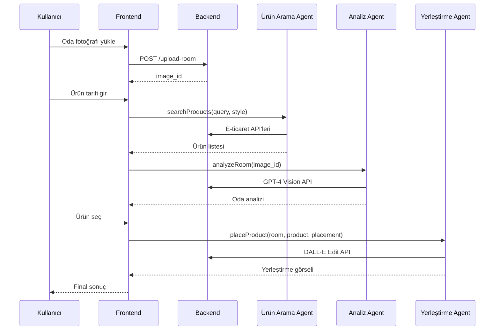

# 🎨 AI Destekli Dekoratif Ürün Yerleştirme Sistemi

## 📋 Proje Özeti

Bu sistem, kullanıcıların oda fotoğraflarını yükleyerek AI destekli dekoratif ürün yerleştirme deneyimi yaşamalarını sağlar. 3 farklı AI agent koordineli şekilde çalışarak kullanıcıya mükemmel dekorasyon önerileri sunar.

## 🧠 AI Agent Mimarisi

### Agent 1: Ürün Arama Ajanı
- **Görev**: Kullanıcının metin tanımından uygun ürünleri bulma
- **Teknoloji**: OpenAI GPT-4 + E-ticaret API'leri
- **API'ler**: Amazon Product API, Google Shopping API, Etsy API
- **Çıktı**: Filtrelenmiş ürün listesi (görsel + detay + fiyat)

**Prompt Örneği:**
```
Kullanıcı istegi: "mavi tonlarda soyut tablo"
Oda stili: "Modern Minimalist"
Oda renkleri: ["Mavi", "Beyaz", "Gri"]

Sen bir e-ticaret uzmanısın. Bu bilgilere göre:
1. Arama terimlerini optimize et
2. En uygun ürünleri filtrele
3. Oda stiliyle uyumlu örnekleri öne çıkar
4. Boyut önerisi yap
5. Fiyat/kalite dengesi kur

Sonucu JSON formatında döndür.
```

### Agent 2: Oda Görsel Analiz Ajanı
- **Görev**: Oda fotoğrafını analiz ederek stil, renk, yerleştirme alanları belirleme
- **Teknoloji**: GPT-4 Vision API
- **Çıktı**: Oda stili, renk paleti, yerleştirme koordinatları, öneriler

**Prompt Örneği:**
```
Bu oda fotoğrafını detaylı analiz et:

1. ODA STİLİ:
   - Modern, Klasik, Minimalist, Bohem vb. belirleme
   - Döşeme ve mobilya stili analizi

2. RENK ANALİZİ:
   - Baskın renkler (HSL değerleri)
   - Renk uyumu analizi
   - Aksan rengi önerileri

3. IŞIK DURUMU:
   - Doğal/yapay ışık
   - Işık yönü ve şiddeti
   - Gölge alanları

4. YERLEŞTIRME ANALİZİ:
   - En uygun duvar alanları (piksel koordinatları)
   - Perspektif analizi
   - Görüş açısı optimizasyonu

5. BOYUT ÖNERİLERİ:
   - İdeal tablo boyutları
   - Orantı hesaplamaları

JSON formatında döndür: {style, colors, lighting, placementAreas, suggestions}
```

### Agent 3: Yerleştirme Ajanı  
- **Görev**: Seçilen ürünü oda fotoğrafına doğal şekilde yerleştirme
- **Teknoloji**: DALL·E Edit API veya Stable Diffusion + ControlNet
- **Çıktı**: Fotorealistik yerleştirme görseli

**Prompt Örneği:**
```
BU ODAYA TABLOYU YERLEŞTIR:

Oda bilgileri:
- Stil: {analiz_sonucu.style}
- Baskın renkler: {analiz_sonucu.colors}
- Işık durumu: {analiz_sonucu.lighting}

Yerleştirme gereksinimleri:
- Koordinat: x:{area.x}%, y:{area.y}%
- Boyut: {area.width}% x {area.height}%
- Perspektifi koru
- Doğal gölgelendirme yap
- Odanın ışık koşullarına uyumlu hale getir
- Renk tonlarını oda ile uyumlu yap

SONUÇ: Fotorealistik, profesyonel dekorasyon görseli
```

## 🏗️ Sistem Mimarisi

### Frontend (React + TypeScript)
```
src/
├── components/
│   ├── AIAgent.tsx          # AI agent durum göstergesi
│   ├── ImageUploader.tsx    # Dosya yükleme bileşeni
│   ├── ProductSearch.tsx    # Ürün arama arayüzü
│   ├── RoomAnalysis.tsx     # Oda analiz sonuçları
│   └── PlacementResult.tsx  # Final yerleştirme sonucu
├── services/
│   └── aiService.ts         # AI API entegrasyonları
└── pages/
    └── Index.tsx            # Ana sayfa
```

### Backend API Endpointleri (Python/Node.js)
```python
# Flask örneği
from flask import Flask, request, jsonify
import openai
import requests
from PIL import Image
import base64

app = Flask(__name__)

@app.route('/api/upload-room', methods=['POST'])
def upload_room():
    """Oda fotoğrafı yükleme"""
    file = request.files['room_image']
    # Cloud storage'a kaydet
    # Base64'e çevir
    # Image ID döndür
    return jsonify({'success': True, 'image_id': 'room_123'})

@app.route('/api/search-products', methods=['POST'])
def search_products():
    """AI ürün arama"""
    data = request.json
    query = data['query']
    room_style = data.get('room_style')
    
    # OpenAI ile query optimize et
    optimized_query = optimize_search_query(query, room_style)
    
    # E-ticaret API'lerden arama yap
    amazon_results = search_amazon(optimized_query)
    etsy_results = search_etsy(optimized_query)
    
    # Sonuçları birleştir ve filtrele
    filtered_results = filter_and_rank_products(
        amazon_results + etsy_results, 
        room_style
    )
    
    return jsonify(filtered_results)

@app.route('/api/analyze-room', methods=['POST'])
def analyze_room():
    """GPT-4 Vision ile oda analizi"""
    data = request.json
    image_id = data['image_id']
    
    # Image ID'den base64 al
    image_base64 = get_image_from_storage(image_id)
    
    # GPT-4 Vision API çağrısı
    analysis = openai.ChatCompletion.create(
        model="gpt-4-vision-preview",
        messages=[
            {
                "role": "user",
                "content": [
                    {"type": "text", "text": ROOM_ANALYSIS_PROMPT},
                    {"type": "image_url", "image_url": {"url": image_base64}}
                ]
            }
        ]
    )
    
    return jsonify(analysis.choices[0].message.content)

@app.route('/api/place-product', methods=['POST'])
def place_product():
    """DALL·E ile ürün yerleştirme"""
    data = request.json
    room_image_id = data['room_image_id']
    product_image_id = data['product_image_id']
    placement_data = data['placement_data']
    
    # DALL·E Edit API çağrısı
    result = openai.Image.create_edit(
        image=get_image_from_storage(room_image_id),
        mask=generate_placement_mask(placement_data),
        prompt=generate_placement_prompt(placement_data),
        n=1,
        size="1024x1024"
    )
    
    return jsonify({'success': True, 'result_url': result.data[0].url})
```

## 📊 Veri Akışı



## 🎨 UI/UX Akışı

### 1. Karşılama Sayfası
- **Hero Section**: AI teknolojisi vurgusu
- **Özellik Kartları**: 3 AI agent'ın açıklaması
- **Demo Video**: Nasıl çalıştığını gösteren kısa video

### 2. Yükleme Aşaması
- **Drag & Drop**: Kolay dosya yükleme
- **Önizleme**: Yüklenen görsel kontrolü
- **Progress Bar**: İşlem durumu göstergesi

### 3. Ürün Seçimi
- **Dual Tab**: "Tarif Et" vs "Yükle"
- **Real-time Arama**: Yazarken anlık öneriler
- **Ürün Kartları**: Görsel + fiyat + rating
- **Filtreleme**: Fiyat, marka, boyut filtreleri

### 4. Analiz Sonuçları
- **Interaktif Oda Görüntüsü**: Yerleştirme alanları işaretli
- **Stil Analizi**: Renk paleti, oda stili
- **AI Önerileri**: Akıllı tavsiyeler

### 5. Final Sonuç
- **Before/After**: Karşılaştırmalı görünüm
- **Paylaşım**: Sosyal medya entegrasyonu
- **İndirme**: Yüksek çözünürlük export

## 🚀 Gelişmiş Özellikler

### 1. Stil Öğrenme Sistemi
```python
class UserStyleLearning:
    def __init__(self):
        self.user_preferences = {}
    
    def learn_from_selection(self, user_id, selected_products, room_styles):
        """Kullanıcının seçimlerinden stil tercihi öğren"""
        # Machine Learning modeli ile tercihleri analiz et
        # Gelecek önerileri kişiselleştir
        pass
    
    def get_personalized_recommendations(self, user_id, room_analysis):
        """Kişiselleştirilmiş öneriler sun"""
        # Kullanıcının geçmiş tercihlerine göre filtrele
        pass
```

### 2. Çoklu Ürün Yerleştirme
- Aynı odaya birden fazla ürün yerleştirme
- Ürünler arası uyum kontrolü
- Toplam bütçe hesaplama

### 3. AR Görünüm (Gelecek)
- Telefon kamerası ile canlı önizleme
- Gerçek boyut simülasyonu
- 360° oda görünümü

### 4. Sosyal Özellikler
- Topluluk galerisi
- Beğeni ve yorum sistemi
- Uzman dekoratör tavsiyeleri

## 💰 Monetizasyon Stratejisi

### 1. Freemium Model
- **Ücretsiz**: 3 yerleştirme/ay, standart kalite
- **Premium**: Sınırsız yerleştirme, 4K kalite, öncelikli işleme

### 2. Affiliate Sistemi
- E-ticaret sitelerinden komisyon
- Seçilen ürünlere yönlendirme linkleri

### 3. B2B Çözümler
- Mobilyacılar için white-label çözüm
- İç mimarlık ofisleri için API

## 📈 Performans Optimizasyonları

### 1. Caching Stratejisi
```python
import redis

class CacheManager:
    def __init__(self):
        self.redis_client = redis.Redis()
    
    def cache_room_analysis(self, image_hash, analysis):
        """Oda analizi sonuçlarını önbellekle"""
        self.redis_client.setex(
            f"room_analysis:{image_hash}", 
            3600, 
            json.dumps(analysis)
        )
    
    def get_cached_analysis(self, image_hash):
        """Önbellekten analiz sonucu al"""
        cached = self.redis_client.get(f"room_analysis:{image_hash}")
        return json.loads(cached) if cached else None
```

### 2. Asenkron İşleme
```python
from celery import Celery

celery_app = Celery('ai_decorator')

@celery_app.task
def process_room_analysis(image_id):
    """Oda analizini background'da işle"""
    # Uzun süren AI işlemlerini queue'ya al
    pass

@celery_app.task
def generate_placement(room_id, product_id, placement_data):
    """Yerleştirme görselini background'da oluştur"""
    # DALL·E API çağrısını queue'ya al
    pass
```

## 🔧 Kurulum ve Deployment

### Development
```bash
# Frontend
npm install
npm run dev

# Backend
pip install -r requirements.txt
export OPENAI_API_KEY="your-key"
export AMAZON_API_KEY="your-key"
flask run
```

### Production (Docker)
```dockerfile
FROM node:18 AS frontend
WORKDIR /app
COPY package*.json ./
RUN npm install
COPY . .
RUN npm run build

FROM python:3.9 AS backend
WORKDIR /app
COPY requirements.txt .
RUN pip install -r requirements.txt
COPY . .
EXPOSE 5000
CMD ["gunicorn", "app:app"]
```

## 📊 Metrikler ve Analytics

### 1. Kullanıcı Metrikleri
- Toplam yerleştirme sayısı
- Kullanıcı memnuniyet oranı
- Dönüşüm oranı (görüntüleme → satın alma)

### 2. AI Performance
- Model accuracy scores
- İşlem süreleri
- API maliyet optimizasyonu

### 3. İş Metrikleri  
- Affiliate komisyon geliri
- Premium kullanıcı dönüşümü
- Müşteri yaşam boyu değeri (LTV)

---

Bu sistem, AI teknolojisinin dekorasyon sektöründeki potansiyelini tam olarak kullanarak kullanıcılara benzersiz bir deneyim sunmaktadır. Hem teknik ekipler hem de iş geliştirme ekipleri için net bir roadmap sağlamaktadır.