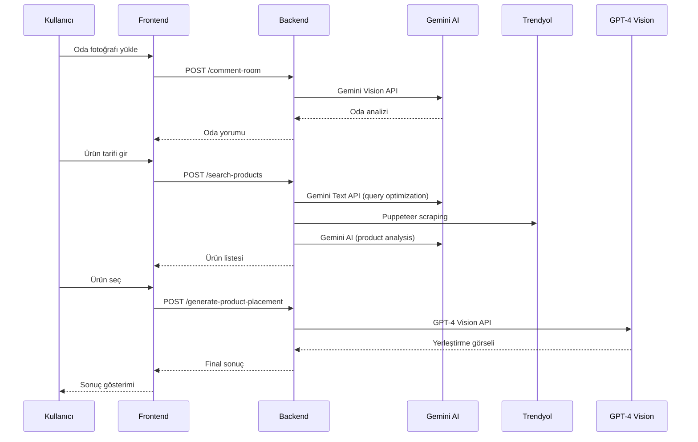

# 🎨 AI Destekli Dekoratif Ürün Yerleştirme Sistemi

## 📋 Proje Özeti

Bu sistem, kullanıcıların oda fotoğraflarını yükleyerek AI destekli dekoratif ürün yerleştirme deneyimi yaşamalarını sağlar. 3 farklı AI agent koordineli şekilde çalışarak kullanıcıya mükemmel dekorasyon önerileri sunar.

## 🧠 AI Agent Mimarisi

### Agent 1: Ürün Arama Ajanı
- **Görev**: Kullanıcının metin tanımından uygun ürünleri bulma
- **Teknoloji**: Gemini AI + Trendyol Scraping
- **API'ler**: Gemini Text API, Puppeteer (Trendyol scraping)
- **Çıktı**: Filtrelenmiş ürün listesi (görsel + detay + fiyat)

**Prompt Örneği:**
```
Kullanıcı istegi: "mavi tonlarda soyut tablo"
Oda stili: "Modern Minimalist"
Oda renkleri: ["Mavi", "Beyaz", "Gri"]

Sen bir e-ticaret uzmanısın. Bu bilgilere göre:
1. Arama terimlerini optimize et
2. En uygun ürünleri filtrele
3. Oda stiliyle uyumlu örnekleri öne çıkar
4. Boyut önerisi yap
5. Fiyat/kalite dengesi kur

Sonucu JSON formatında döndür.
```

### Agent 2: Yerleştirme Ajanı  
- **Görev**: Seçilen ürünü oda fotoğrafına doğal şekilde yerleştirme
- **Teknoloji**: GPT-4 Vision API
- **Çıktı**: Fotorealistik yerleştirme görseli

**Prompt Örneği:**
```
BU ODAYA TABLOYU YERLEŞTIR:

Oda bilgileri:
- Stil: {analiz_sonucu.style}
- Baskın renkler: {analiz_sonucu.colors}
- Işık durumu: {analiz_sonucu.lighting}

Yerleştirme gereksinimleri:
- Koordinat: x:{area.x}%, y:{area.y}%
- Boyut: {area.width}% x {area.height}%
- Perspektifi koru
- Doğal gölgelendirme yap
- Odanın ışık koşullarına uyumlu hale getir
- Renk tonlarını oda ile uyumlu yap

SONUÇ: Fotorealistik, profesyonel dekorasyon görseli
```

### Agent 3: Oda Yorum Ajanı
- **Görev**: Oda fotoğrafını analiz ederek detaylı yorum ve öneriler sunma
- **Teknoloji**: Gemini Vision API
- **Çıktı**: Oda analizi, stil önerileri, dekoratif ürün tavsiyeleri

**Prompt Örneği:**
```
Bu oda fotoğrafını detaylı analiz et:

1. ODA STİLİ:
   - Modern, Klasik, Minimalist, Bohem vb. belirleme
   - Döşeme ve mobilya stili analizi

2. RENK ANALİZİ:
   - Baskın renkler (HSL değerleri)
   - Renk uyumu analizi
   - Aksan rengi önerileri

3. ATMOSFER:
   - Oda atmosferi ve hissi
   - Eksik olan dekoratif elementler
   - İyileştirme önerileri

4. DEKORATİF ÖNERİLER:
   - Uygun ürün kategorileri
   - Boyut ve stil önerileri
   - Renk uyumu tavsiyeleri

JSON formatında döndür: {style, colors, atmosphere, suggestions}
```

## 🏗️ Sistem Mimarisi

### Frontend (React + TypeScript)
```
src/
├── components/
│   ├── AIAgent.tsx          # AI agent durum göstergesi (tooltip'li)
│   ├── ImageUploader.tsx    # Dosya yükleme bileşeni
│   ├── ProductSearch.tsx    # Ürün arama arayüzü
│   ├── PlacementResult.tsx  # GPT-4 Vision sonuç gösterimi
│   ├── RoomComment.tsx      # Gemini AI oda yorumları
│   └── DecorSuggestions.tsx # Dekoratif ürün önerileri
├── services/
│   └── aiService.ts         # AI API entegrasyonları
└── pages/
    └── Index.tsx            # Ana sayfa (3 adımlı süreç)
```

### Backend API Endpointleri (Node.js)
```javascript
// Express.js örneği
const express = require('express');
const multer = require('multer');
const { GoogleGenerativeAI } = require('@google/generative-ai');
const puppeteer = require('puppeteer');

const app = express();

// Gemini AI konfigürasyonu
const genAI = new GoogleGenerativeAI(process.env.GEMINI_API_KEY);

app.post('/api/search-products', async (req, res) => {
  try {
    const { query, roomStyle, roomColors } = req.body;
    
    // Gemini AI ile query optimizasyonu
    const model = genAI.getGenerativeModel({ model: "gemini-pro" });
    const optimizedQuery = await model.generateContent(`
      "${query}" aramasını dekoratif ürün arama için optimize et.
      Oda stili: ${roomStyle}
      Renkler: ${roomColors.join(', ')}
    `);
    
    // Trendyol scraping
    const products = await scrapeTrendyolProducts(optimizedQuery.response.text());
    
    // Gemini AI ile ürün analizi ve sıralama
    const analyzedProducts = await analyzeProductsWithAI(products, query, roomStyle);
    
    res.json({ success: true, products: analyzedProducts });
  } catch (error) {
    res.status(500).json({ error: error.message });
  }
});

app.post('/api/comment-room', async (req, res) => {
  try {
    const { imageBase64 } = req.body;
    
    // Gemini Vision ile oda analizi
    const model = genAI.getGenerativeModel({ model: "gemini-pro-vision" });
    const result = await model.generateContent([
      "Bu oda fotoğrafını detaylı analiz et ve dekorasyon önerileri sun.",
      {
        inlineData: {
          mimeType: "image/jpeg",
          data: imageBase64
        }
      }
    ]);
    
    res.json({ 
      success: true, 
      comment: {
        text: result.response.text(),
        confidence: 0.95,
        timestamp: new Date().toISOString()
      }
    });
  } catch (error) {
    res.status(500).json({ error: error.message });
  }
});

app.post('/api/suggest-decor-products', async (req, res) => {
  try {
    const { imageBase64 } = req.body;
    
    // Gemini Vision ile dekoratif ürün önerileri
    const model = genAI.getGenerativeModel({ model: "gemini-pro-vision" });
    const result = await model.generateContent([
      "Bu oda için uygun dekoratif ürün kategorilerini ve önerilerini listele.",
      {
        inlineData: {
          mimeType: "image/jpeg",
          data: imageBase64
        }
      }
    ]);
    
    const suggestions = parseDecorSuggestions(result.response.text());
    
    res.json({ success: true, suggestions });
  } catch (error) {
    res.status(500).json({ error: error.message });
  }
});

app.post('/api/generate-product-placement', async (req, res) => {
  try {
    const { roomImage, productImage } = req.files;
    
    // GPT-4 Vision API ile ürün yerleştirme
    const response = await fetch('https://api.openai.com/v1/chat/completions', {
      method: 'POST',
      headers: {
        'Authorization': `Bearer ${process.env.OPENAI_API_KEY}`,
        'Content-Type': 'application/json'
      },
      body: JSON.stringify({
        model: "gpt-4-vision-preview",
        messages: [
          {
            role: "user",
            content: [
              {
                type: "text",
                text: "Bu odaya ürünü doğal şekilde yerleştir. Perspektifi koru, gölgelendirme yap ve odanın ışık koşullarına uyumlu hale getir."
              },
              {
                type: "image_url",
                image_url: {
                  url: `data:image/jpeg;base64,${roomImage.toString('base64')}`
                }
              },
              {
                type: "image_url",
                image_url: {
                  url: `data:image/jpeg;base64,${productImage.toString('base64')}`
                }
              }
            ]
          }
        ],
        max_tokens: 1000
      })
    });
    
    const result = await response.json();
    
    res.json({ 
      success: true, 
      image: result.choices[0].message.content,
      message: "GPT-4 Vision ile ürün başarıyla yerleştirildi"
    });
  } catch (error) {
    res.status(500).json({ error: error.message });
  }
});
```

## 📊 Veri Akışı



## 🎨 UI/UX Akışı

### 1. Karşılama Sayfası
- **Hero Section**: AI teknolojisi vurgusu
- **Özellik Kartları**: 3 AI agent'ın açıklaması (tooltip'li)
- **Demo Video**: Nasıl çalıştığını gösteren kısa video

### 2. Yükleme Aşaması
- **Drag & Drop**: Kolay dosya yükleme
- **Önizleme**: Yüklenen görsel kontrolü
- **Progress Bar**: İşlem durumu göstergesi

### 3. Ürün Seçimi
- **Dual Tab**: "Tarif Et" vs "Yükle"
- **Real-time Arama**: Yazarken anlık öneriler
- **Ürün Kartları**: Görsel + fiyat + rating
- **Filtreleme**: Fiyat, marka, boyut filtreleri

### 4. Final Sonuç
- **Before/After**: Karşılaştırmalı görünüm
- **Paylaşım**: Sosyal medya entegrasyonu
- **İndirme**: Yüksek çözünürlük export

## 🚀 Gelişmiş Özellikler

### 1. Gemini AI Entegrasyonu
```javascript
class GeminiAIService {
  constructor() {
    this.genAI = new GoogleGenerativeAI(process.env.GEMINI_API_KEY);
    this.textModel = this.genAI.getGenerativeModel({ model: "gemini-pro" });
    this.visionModel = this.genAI.getGenerativeModel({ model: "gemini-pro-vision" });
  }
  
  async analyzeRoom(imageBase64) {
    const result = await this.visionModel.generateContent([
      "Bu oda fotoğrafını detaylı analiz et ve dekorasyon önerileri sun.",
      {
        inlineData: {
          mimeType: "image/jpeg",
          data: imageBase64
        }
      }
    ]);
    return result.response.text();
  }
  
  async optimizeSearchQuery(query, roomStyle) {
    const result = await this.textModel.generateContent(`
      "${query}" aramasını dekoratif ürün arama için optimize et.
      Oda stili: ${roomStyle}
    `);
    return result.response.text();
  }
  
  async suggestDecorProducts(imageBase64) {
    const result = await this.visionModel.generateContent([
      "Bu oda için uygun dekoratif ürün kategorilerini ve önerilerini listele.",
      {
        inlineData: {
          mimeType: "image/jpeg",
          data: imageBase64
        }
      }
    ]);
    return result.response.text();
  }
}
```

### 2. Trendyol Scraping Sistemi
```javascript
class TrendyolScraper {
  async scrapeProducts(query) {
    const browser = await puppeteer.launch({ headless: true });
    const page = await browser.newPage();
    
    // Trendyol arama sayfasına git
    await page.goto(`https://www.trendyol.com/sr?q=${encodeURIComponent(query)}`);
    
    // Ürünleri çek
    const products = await page.evaluate(() => {
      const productCards = document.querySelectorAll('[data-testid="product-card"]');
      return Array.from(productCards).map(card => ({
        name: card.querySelector('.prdct-desc-cntnr-name').textContent,
        price: card.querySelector('.prc-box-dscntd').textContent,
        image: card.querySelector('img').src,
        link: card.href
      }));
    });
    
    await browser.close();
    return products;
  }
}
```

### 3. Tooltip Sistemi
```typescript
// AIAgent.tsx
const agentConfig = {
  search: {
    tooltip: {
      title: 'Ürün Arama Agent',
      description: 'Bu AI ajanı, metinsel açıklamalarınızı analiz ederek en uygun dekoratif ürünleri bulur.',
      features: [
        'Metinsel açıklamaları analiz eder',
        'Oda tarzına uygun ürünler bulur',
        'Renk uyumunu göz önünde bulundurur',
        'Bütçe dostu seçenekler sunar',
        'Trend dekorasyon ürünlerini önerir'
      ]
    }
  }
};
```

## 💰 Monetizasyon Stratejisi

### 1. Freemium Model
- **Ücretsiz**: 3 yerleştirme/ay, standart kalite
- **Premium**: Sınırsız yerleştirme, 4K kalite, öncelikli işleme

### 2. Affiliate Sistemi
- Trendyol'dan komisyon
- Seçilen ürünlere yönlendirme linkleri

### 3. B2B Çözümler
- Mobilyacılar için white-label çözüm
- İç mimarlık ofisleri için API

## 📈 Performans Optimizasyonları

### 1. Caching Stratejisi
```javascript
const redis = require('redis');
const client = redis.createClient();

class CacheManager {
  async cacheRoomAnalysis(imageHash, analysis) {
    await client.setex(`room_analysis:${imageHash}`, 3600, JSON.stringify(analysis));
  }
  
  async getCachedAnalysis(imageHash) {
    const cached = await client.get(`room_analysis:${imageHash}`);
    return cached ? JSON.parse(cached) : null;
  }
}
```

### 2. Asenkron İşleme
```javascript
const Queue = require('bull');

const analysisQueue = new Queue('room-analysis');
const placementQueue = new Queue('product-placement');

analysisQueue.process(async (job) => {
  const { imageBase64 } = job.data;
  return await geminiService.analyzeRoom(imageBase64);
});

placementQueue.process(async (job) => {
  const { roomImage, productImage } = job.data;
  return await gpt4Service.generatePlacement(roomImage, productImage);
});
```

## 🔧 Kurulum ve Deployment

### Development
```bash
# Frontend
npm install
npm run dev

# Backend
cd backend
npm install
cp env.example .env
# .env dosyasını düzenle
npm run dev
```

### Environment Variables
```env
# AI API Keys
GEMINI_API_KEY=your-gemini-api-key-here
OPENAI_API_KEY=your-openai-api-key-here

# Server Configuration
PORT=5000
NODE_ENV=development
```

### Production (Docker)
```dockerfile
FROM node:18 AS frontend
WORKDIR /app
COPY package*.json ./
RUN npm install
COPY . .
RUN npm run build

FROM node:18 AS backend
WORKDIR /app
COPY package*.json ./
RUN npm install
COPY . .
EXPOSE 5000
CMD ["npm", "start"]
```

## 📊 Metrikler ve Analytics

### 1. Kullanıcı Metrikleri
- Toplam yerleştirme sayısı
- Kullanıcı memnuniyet oranı
- Dönüşüm oranı (görüntüleme → satın alma)

### 2. AI Performance
- Gemini API response times
- GPT-4 Vision accuracy scores
- İşlem süreleri
- API maliyet optimizasyonu

### 3. İş Metrikleri  
- Affiliate komisyon geliri
- Premium kullanıcı dönüşümü
- Müşteri yaşam boyu değeri (LTV)

## 🤖 AI Teknolojileri Detayları

### Gemini AI Kullanım Alanları
1. **Oda Analizi**: Vision API ile görsel analiz
2. **Ürün Arama Optimizasyonu**: Text API ile query optimization
3. **Dekoratif Öneriler**: Vision + Text kombinasyonu
4. **Metin İşleme**: Ürün açıklamaları ve yorumlar

### GPT-4 Vision Entegrasyonu
1. **Ürün Yerleştirme**: Gerçekçi görsel oluşturma
2. **Perspektif Koruma**: Doğal görünüm sağlama
3. **Işık Uyumu**: Oda koşullarına uyarlama
4. **Gölgelendirme**: Gerçekçi gölge efektleri

---

Bu sistem, modern AI teknolojilerinin dekorasyon sektöründeki potansiyelini tam olarak kullanarak kullanıcılara benzersiz bir deneyim sunmaktadır. Gemini AI ve GPT-4 Vision entegrasyonu ile güçlü bir AI destekli dekorasyon platformu oluşturulmuştur.