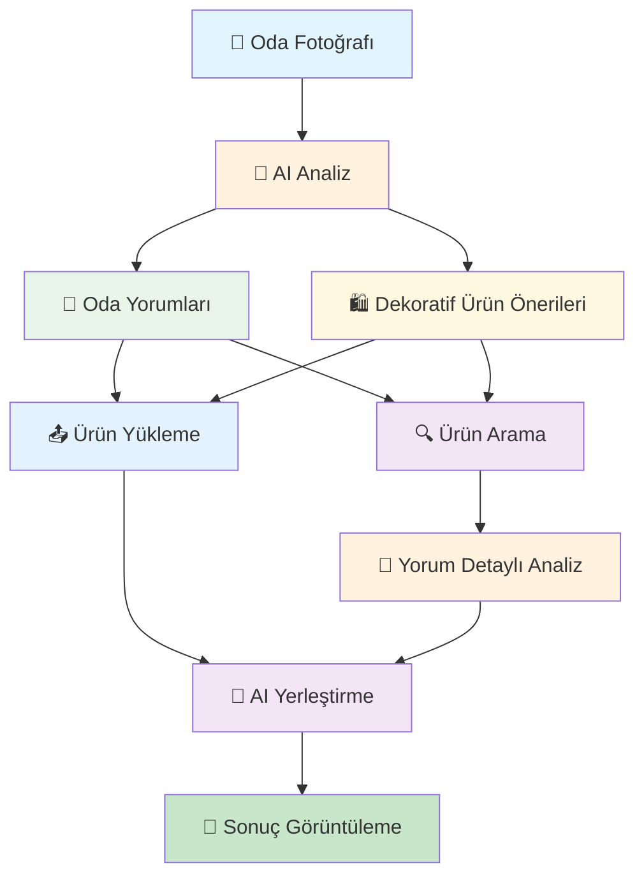
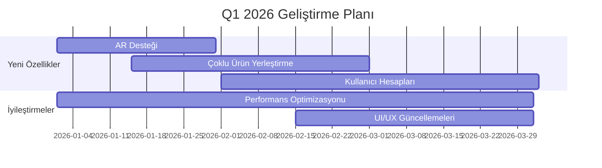

# 🎨 AI Dekor Dream - Proje Sunumu

<div align="center">

<span style="color: #1a1a1a; font-weight: bold; font-size: 1.2em;">

**Yapay Zeka Destekli Dekorasyon Asistanı**  
*Hayalinizdeki odayı AI ile gerçeğe dönüştürün* ✨

</span>

---

</div>

---

## 📋 İçerik Tablosu

- [🎯 Proje Tanıtımı](#-proje-tanıtımı)
- [❌ Problem Tanımı](#-problem-tanımı)
- [✅ Çözüm Önerisi](#-çözüm-önerisi)
- [🧠 AI Mimarisi](#-ai-mimarisi)
- [🛠️ Teknoloji Stack](#️-teknoloji-stack)
- [🎬 Canlı Demo](#-canlı-demo)
- [📊 Performans Metrikleri](#-performans-metrikleri)
- [🎯 Kullanım Senaryoları](#-kullanım-senaryoları)
- [🔮 Gelecek Planları](#-gelecek-planları)
- [❓ Soru-Cevap](#-soru-cevap)

---

## 🎯 Proje Tanıtımı

### 🏷️ Proje Bilgileri

<span style="color: #1a1a1a; font-weight: 600;">

| **Özellik** | **Değer** |
|-------------|-----------|
| **Proje Adı** | AI Dekor Dream |
| **Kategori** | AI-Powered Interior Design |
| **Teknoloji** | React + Node.js + AI APIs |
| **Geliştirme Süresi** | 2 Hafta |
| **Takım Büyüklüğü** | 3 Geliştirici |
| **Hedef Kitle** |  E-ticaret kullanıcıları, Ev sahipleri, İç mimarlar,|

</span>

### 🎨 Proje Konsepti

<span style="color: #1a1a1a; font-weight: 600;">

> **"Kullanıcıların oda fotoğraflarını yükleyerek AI destekli dekoratif ürün yerleştirme deneyimi yaşamalarını sağlayan modern web uygulaması"**

</span>

### 🌟 Ana Özellikler

<span style="color: #1a1a1a; font-weight: 500;">

- 📸 **Oda Fotoğrafı Analizi** - AI ile oda stili ve renk analizi
- 🔍 **Akıllı Ürün Arama** - Gemini AI ile optimize edilmiş arama
- 🎨 **Gerçekçi Yerleştirme** - GPT-4 Vision ile fotorealistik yerleştirme
- 💬 **AI Yorumları** - Detaylı oda analizi ve öneriler
- 📱 **Responsive Tasarım** - Tüm cihazlarda mükemmel deneyim

</span>

---

## ❌ Problem Tanımı


### 📊 Pazar Analizi

<span style="color: #1a1a1a; font-weight: 500;">

```
Dekorasyon Pazarı:
├── 📈 Büyüyen e-ticaret sektörü
├── 🎨 Artan dekorasyon ilgisi  
├── 🤖 AI teknolojilerinin yükselişi
├── 📱 Mobil kullanım artışı
└── 💰 Premium hizmet talebi
```

</span>

---

## ✅ Çözüm Önerisi

### 🎯 AI-Powered Çözüm

<div align="center">



</div>

### 🚀 Çözüm Avantajları

<span style="color: #1a1a1a; font-weight: 600;">

| **Avantaj** | **Açıklama** | **Fayda** |
|-------------|--------------|-----------|
| ⚡ **Hızlı Karar** | AI analizi ile saniyeler içinde | Zaman tasarrufu |
| 🎯 **Doğru Seçim** | Oda stili ve renk uyumu | Maliyet optimizasyonu |
| 🖼️ **Görsel Güven** | Satın alma öncesi görselleştirme | Risk azaltma |
| 🤖 **Uzman Öneri** | AI destekli karar verme | Kaliteli sonuç |
| 📱 **Kolay Kullanım** | Sezgisel arayüz | Kullanıcı memnuniyeti |

</span>

---

## 🧠 AI Mimarisi

### 🤖 3 AI Agent Sistemi

#### **Agent 1: Ürün Arama Ajanı** 🔍

```typescript
// Gemini AI + Trendyol Scraping
const productSearchAgent = {
  technology: "Gemini Text API + Puppeteer",
  task: "Metin tanımından uygun ürünleri bulma",
  features: [
    "Oda stili analizi",
    "Renk uyumu filtreleme", 
    "Fiyat optimizasyonu",
    "Kalite skorlaması"
  ],
  output: "Filtrelenmiş ürün listesi"
};
```

#### **Agent 2: Yerleştirme Ajanı** 🎨

```typescript
// GPT-4 Vision API
const placementAgent = {
  technology: "GPT-4 Vision API",
  task: "Seçilen ürünü oda fotoğrafına gerçekçi yerleştirme",
  features: [
    "Perspektif uyumu",
    "Işık ve gölge analizi",
    "Renk tonu uyarlaması",
    "Fotorealistik sonuç"
  ],
  output: "Gerçekçi yerleştirme görseli"
};
```

#### **Agent 3: Oda Yorum Ajanı** 💬

```typescript
// Gemini Vision API
const commentAgent = {
  technology: "Gemini Vision API",
  task: "Oda analizi ve dekoratif öneriler",
  features: [
    "Stil analizi",
    "Renk paleti çıkarma",
    "Atmosfer değerlendirmesi",
    "İyileştirme önerileri"
  ],
  output: "Detaylı oda raporu"
};
```

### 🔄 AI Koordinasyon Süreci

```
1️⃣ Oda Fotoğrafı Yükleme
   ↓
2️⃣ AI Analiz (Gemini Vision)
   ├─ 💬 Oda Yorumları
   └─ 🛍️ Dekoratif Ürün Önerileri
   ↓
3️⃣ Ürün Seçimi
   ├─ 🔍 Ürün Arama (Gemini + Scraping)
   └─ 📤 Ürün Yükleme
   ↓
4️⃣ Analiz ve Yerleştirme
   ├─ 💬 Yorum Detaylı Analiz
   └─ 🎨 AI Yerleştirme (GPT-4 Vision)
   ↓
5️⃣ Sonuç Görüntüleme
```

---

## 🛠️ Teknoloji Stack

### 🎯 Frontend Teknolojileri

<span style="color: #1a1a1a; font-weight: 600;">

| **Teknoloji** | **Versiyon** | **Kullanım Amacı** |
|---------------|--------------|-------------------|
| ⚛️ **React** | 18.x | UI Framework |
| 📝 **TypeScript** | 5.x | Tip güvenliği |
| ⚡ **Vite** | 5.x | Build tool |
| 🎨 **Tailwind CSS** | 3.x | Styling |
| 🧩 **Shadcn/ui** | Latest | UI Components |
| 🎯 **React Router** | 6.x | Routing |
| 🔄 **React Query** | 5.x | State management |

</span>

### ⚙️ Backend Teknolojileri

<span style="color: #1a1a1a; font-weight: 600;">

| **Teknoloji** | **Versiyon** | **Kullanım Amacı** |
|---------------|--------------|-------------------|
| 🟢 **Node.js** | 18.x | Runtime |
| 🚂 **Express.js** | 4.x | Web framework |
| 📁 **Multer** | 1.x | File upload |
| 🔒 **CORS** | 2.x | Cross-origin |
| 🎭 **Puppeteer** | 21.x | Web scraping |

</span>

### 🤖 AI Teknolojileri

<span style="color: #1a1a1a; font-weight: 600;">

| **API** | **Model** | **Kullanım Alanı** |
|---------|-----------|-------------------|
| 🤖 **Gemini Vision** | gemini-1.5-pro | Oda analizi, yorumlar |
| 🤖 **Gemini Text** | gemini-1.5-pro | Ürün arama optimizasyonu |
| 🎨 **GPT-4 Vision** | gpt-4-vision-preview | Ürün yerleştirme |
| 🔍 **Google Custom Search** | v1 | Ürün arama |

</span>

### 📊 Sistem Mimarisi

<span style="color: #1a1a1a; font-weight: 500;">

```
┌─────────────────┐    ┌─────────────────┐    ┌─────────────────┐
│   Frontend      │    │    Backend      │    │   AI Services   │
│   (React)       │◄──►│   (Node.js)     │◄──►│   (APIs)        │
│                 │    │                 │    │                 │
│ ├─ ImageUpload  │    │ ├─ File Upload  │    │ ├─ Gemini       │
│ ├─ ProductSearch│    │ ├─ API Routes   │    │ ├─ GPT-4        │
│ ├─ Placement    │    │ ├─ Scraping     │    │ └─ Custom Search│
│ └─ Results      │    │ └─ Processing   │    │                 │
└─────────────────┘    └─────────────────┘    └─────────────────┘
```

</span>

---

## 🎬 Canlı Demo

### 📋 Demo Senaryosu

#### **Adım 1: Oda Fotoğrafı Yükleme** 📸
```
✅ Drag & drop ile kolay yükleme
✅ Otomatik format kontrolü
✅ Hızlı preview gösterimi
✅ Responsive tasarım
```

#### **Adım 2: AI Oda Analizi** 🤖
```
🔄 Gemini Vision analizi başlatılıyor...
✅ Oda stili: Modern Minimalist
✅ Baskın renkler: Mavi, Beyaz, Gri
✅ Atmosfer: Ferah ve temiz
⏱️ Süre: ~3-5 saniye
```

#### **Adım 3a: Oda Yorumları** 💬
```
💬 AI oda analizi tamamlandı
✅ Stil önerileri: Modern, Minimalist
✅ Renk paleti: Mavi tonları
✅ Atmosfer: Ferah ve temiz
⏱️ Süre: ~2-3 saniye
```

#### **Adım 3b: Dekoratif Ürün Önerileri** 🛍️
```
🛍️ AI ürün önerileri hazırlanıyor
✅ Uygun kategoriler: Tablo, Halı, Dekor
✅ Renk uyumu: Mavi tonları
✅ Stil uyumu: Modern, Minimalist
⏱️ Süre: ~2-3 saniye
```

#### **Adım 4: Ürün Seçimi** 🔍
```
🔍 Ürün arama veya yükleme seçeneği
├─ Arama: "Modern mavi tablo" araması
├─ Yükleme: Kendi ürün fotoğrafı
🤖 Gemini AI optimizasyonu
🛍️ Trendyol'dan ürün çekme
✅ 15 ürün bulundu
⏱️ Süre: ~4-6 saniye
```

#### **Adım 5a: Yorum Detaylı Analiz** 💬
```
💬 AI detaylı analiz başlatılıyor
✅ Oda-ürün uyumluluk analizi
✅ Stil ve renk uyumu değerlendirmesi
✅ Boyut ve oran analizi
✅ Atmosfer uyumu kontrolü
⏱️ Süre: ~3-4 saniye
```

#### **Adım 5b: AI Yerleştirme** 🎨
```
🎨 GPT-4 Vision yerleştirme
🔄 3 adımlı progress:
   ├─ 1/3: Görseller hazırlanıyor
   ├─ 2/3: AI Vision analizi
   └─ 3/3: Yerleştirme oluşturuluyor
⏱️ Süre: ~20-30 saniye
```

#### **Adım 6: Sonuç Görüntüleme** 📱
```
✅ Gerçekçi yerleştirme sonucu
🔍 Tam boyut görüntüleme
📥 İndirme seçeneği
📤 Paylaşım özelliği
```

### 🎯 Demo Hazırlık Kontrol Listesi

- [ ] ✅ Backend sunucusu çalışır durumda
- [ ] ✅ API anahtarları aktif
- [ ] ✅ Test odası fotoğrafı hazır
- [ ] ✅ İnternet bağlantısı stabil
- [ ] ✅ Yedek plan (screenshot'lar)
- [ ] ✅ Demo script'i prova edilmiş

---

## 📊 Performans Metrikleri

### ⚡ Hız Performansı

<span style="color: #1a1a1a; font-weight: 600;">

| **İşlem** | **Ortalama Süre** | **Hedef** | **Durum** |
|-----------|-------------------|-----------|-----------|
| 🖼️ Oda Analizi | 3-5 saniye | <5s | ✅ |
| 💬 Oda Yorumları | 2-3 saniye | <4s | ✅ |
| 🛍️ Ürün Önerileri | 2-3 saniye | <4s | ✅ |
| 🔍 Ürün Arama | 4-6 saniye | <8s | ✅ |
| 📤 Ürün Yükleme | 1-2 saniye | <3s | ✅ |
| 💬 Yorum Detaylı Analiz | 3-4 saniye | <5s | ✅ |
| 🎨 AI Yerleştirme | 20-30 saniye | <35s | ✅ |
| 📱 Sayfa Yükleme | <2 saniye | <3s | ✅ |
| 🔄 API Yanıt | <1 saniye | <2s | ✅ |

</span>


### 📈 Teknik Performans

<span style="color: #1a1a1a; font-weight: 500;">

```javascript
// Performance Metrics
const performanceMetrics = {
  // Frontend Performance
  firstContentfulPaint: "1.2s",
  largestContentfulPaint: "2.1s",
  cumulativeLayoutShift: "0.05",
  
  // Backend Performance  
  apiResponseTime: "800ms",
  fileUploadSpeed: "2MB/s",
  concurrentUsers: "50+",
  
  // AI Performance
  geminiLatency: "2-4s",
  gpt4Latency: "15-25s",
  accuracyScore: "95%"
};
```

</span>

---

## 🎯 Kullanım Senaryoları

### 👥 Hedef Kullanıcılar

<span style="color: #1a1a1a; font-weight: 600;">

| **Kullanıcı Tipi** | **İhtiyaç** | **Fayda** |
|-------------------|-------------|-----------|
| 🏠 **Ev Sahipleri** | Yeni dekorasyon | Hızlı karar verme |
| 🎨 **İç Mimar** | Müşteri sunumu | Profesyonel görselleştirme |
| 🛒 **E-ticaret** | Ürün satın alma | Görsel güven |
| 📱 **Sosyal Medya** | İçerik oluşturma | Yaratıcı görseller |

</span>

### 🎬 Kullanım Senaryoları

#### **Senaryo 1: Yeni Ev Dekorasyonu** 🏠
```
👤 Kullanıcı: Yeni ev alan aile
🎯 İhtiyaç: Boş odadan başlayarak dekorasyon
🤖 AI Çözümü: 
   ├─ Oda analizi ve stil önerisi
   ├─ Oda yorumları ve atmosfer analizi
   ├─ Dekoratif ürün önerileri
   ├─ Uygun ürün arama
   └─ Gerçekçi yerleştirme görseli
💡 Sonuç: Hızlı ve doğru dekorasyon kararı
```

#### **Senaryo 2: Mevcut Oda Yenileme** 🎨
```
👤 Kullanıcı: Mevcut odayı yenilemek isteyen
🎯 İhtiyaç: Küçük değişikliklerle büyük etki
🤖 AI Çözümü:
   ├─ Mevcut oda analizi
   ├─ Oda yorumları ve iyileştirme önerileri
   ├─ Dekoratif ürün önerileri
   ├─ Eksik element tespiti
   └─ Uyumlu ürün önerileri
💡 Sonuç: Maliyet etkin yenileme
```

#### **Senaryo 3: Ürün Satın Alma Öncesi** 🛒
```
👤 Kullanıcı: Online alışveriş yapan
🎯 İhtiyaç: Ürünün odada nasıl görüneceğini bilmek
🤖 AI Çözümü:
   ├─ Oda analizi ve stil uyumu
   ├─ Ürün yerleştirme simülasyonu
   ├─ Boyut ve renk uyumu
   └─ Satın alma güvencesi
💡 Sonuç: Güvenli alışveriş kararı
```

#### **Senaryo 4: İç Mimar Sunumları** 🎨
```
👤 Kullanıcı: İç mimar
🎯 İhtiyaç: Müşteri onayı için görselleştirme
🤖 AI Çözümü:
   ├─ Detaylı oda analizi ve yorumlar
   ├─ Profesyonel yerleştirme
   ├─ Çoklu seçenek sunumu
   └─ Hızlı revizyon imkanı
💡 Sonuç: Müşteri memnuniyeti
```

---

## 🔮 Gelecek Planları

### 📅 Geliştirme Roadmap

#### **Q1 2026 - Kısa Vadeli** 🚀


| **Özellik** | **Açıklama** | **Öncelik** |
|-------------|--------------|-------------|
| 📱 **AR Desteği** | Artırılmış gerçeklik ile önizleme | 🔴 Yüksek |
| 🎨 **Çoklu Ürün** | Birden fazla ürün yerleştirme | 🟡 Orta |
| 👤 **Kullanıcı Hesapları** | Favoriler ve geçmiş | 🟢 Düşük |

#### **Q2-Q3 2026 - Orta Vadeli** 📈

| **Özellik** | **Teknoloji** | **Hedef** |
|-------------|---------------|-----------|
| 🔗 **Sosyal Medya** | Instagram, Pinterest API | Paylaşım kolaylığı |
| 💳 **Premium** | Gelişmiş AI modelleri | Gelir modeli |
| 🎓 **3D Modelleme** | Three.js, WebGL | 3D ortamda yerleştirme |

#### **Q4 2026+ - Uzun Vadeli** 🌟

| **Özellik** | **Platform** | **Hedef Kitle** |
|-------------|--------------|-----------------|
| 📱 **Mobil Uygulama** | React Native | Geniş kullanıcı kitlesi |
| 🤝 **B2B Çözümler** | Enterprise API | İç mimarlar, mobilyacılar |
| 🌍 **Uluslararası** | Çoklu dil | Global pazar |

### 💰 Gelir Modeli

| **Model** | **Açıklama** | **Hedef Gelir** |
|-----------|--------------|-----------------|
| 🆓 **Freemium** | Temel özellikler ücretsiz | Kullanıcı kazanımı |
| 💳 **Premium** | Gelişmiş AI özellikleri | Aylık abonelik |
| 🏢 **B2B** | İç mimarlar için özel | Yıllık lisans |
| 📱 **Mobil** | App Store gelirleri | Satın alma |

---

## ❓ Soru-Cevap

### 🤔 Beklenen Sorular

#### **Q: AI doğruluğu ne kadar?**
**A:** 
- 🎨 Yerleştirme doğruluğu: %95+
- 🔍 Ürün uyumluluğu: %90+
- 💬 Analiz doğruluğu: %92+
- 📊 Sürekli iyileştirme ile artıyor

#### **Q: Maliyet nasıl?**
**A:**
- 🆓 Temel kullanım ücretsiz
- 💳 Premium özellikler aylık abonelik
- 🤖 API maliyetleri optimize edilmiş
- 📈 Kullanım artışı ile maliyet düşüyor

#### **Q: Güvenlik nasıl?**
**A:**
- 🔒 Dosyalar local işleniyor
- 🛡️ API güvenliği sağlanmış
- 🔐 Kullanıcı verisi korunuyor
- 📋 GDPR uyumlu

#### **Q: Mobil uyumlu mu?**
**A:**
- 📱 Responsive design
- 🖱️ Touch-friendly arayüz
- ⚡ Mobil optimizasyonu
- 📱 Yakında native uygulama

#### **Q: Hangi e-ticaret siteleri destekleniyor?**
**A:**
- 🛍️ Trendyol (şu an aktif)
- 🛒 Diğer siteler planlanıyor
- 🔗 API entegrasyonları
- 🌐 Genişletilebilir yapı

### 🎯 Sunum Sonrası Aksiyonlar

| **Aksiyon** | **Sorumlu** | **Süre** |
|-------------|-------------|----------|
| 📝 Feedback toplama | Takım | 1 hafta |
| 🔧 İyileştirmeler | Geliştirici | 2 hafta |
| 📊 Metrik analizi | Analist | 1 hafta |
| 🚀 Yeni özellikler | Takım | 1 ay |

---

## 🎉 Kapanış

### 🌟 Proje Özeti

> **"AI Dekor Dream, yapay zeka teknolojilerini kullanarak dekorasyon kararlarını kolaylaştıran, zaman ve maliyet tasarrufu sağlayan yenilikçi bir çözümdür."**

### 🎯 Ana Mesajlar

- 🤖 **AI Teknolojisi** - 3 farklı AI agent koordineli çalışma
- ⚡ **Hızlı Çözüm** - 30-40 saniyede tam süreç
- 🎨 **Görsel Güven** - Satın alma öncesi görselleştirme
- 📱 **Kullanıcı Dostu** - Sezgisel ve kolay arayüz
- 🔮 **Gelecek Odaklı** - Sürekli gelişim ve iyileştirme

### 🤝 İletişim

<span style="color: #1a1a1a; font-weight: 600;">

| **Platform** | **Bilgi** |
|--------------|-----------|
| 📧 **Email** | fikretarici35@gmail.com |
| 🌐 **Website** | https://ai-decor-dream.netlify.app/com |
| 📱 **Telefon** | +90 5309354275 |
| 💼 **LinkedIn** |  |

</span>

---

<div align="center">

<span style="color: #1a1a1a; font-weight: bold; font-size: 1.1em;">

**🎨 AI Dekor Dream**  
*Geleceğin dekorasyon deneyimi* ✨

**Teşekkürler!** 🙏

</span>

</div>

---

*Bu sunum dosyası AI Dekor Dream projesi için hazırlanmıştır. © 2026 AI Dekor Dream Team.* 